# Ripple Tank Control Module
### Engineering Thesis Project | Defended: 9th July, 2024

<p align="center">
  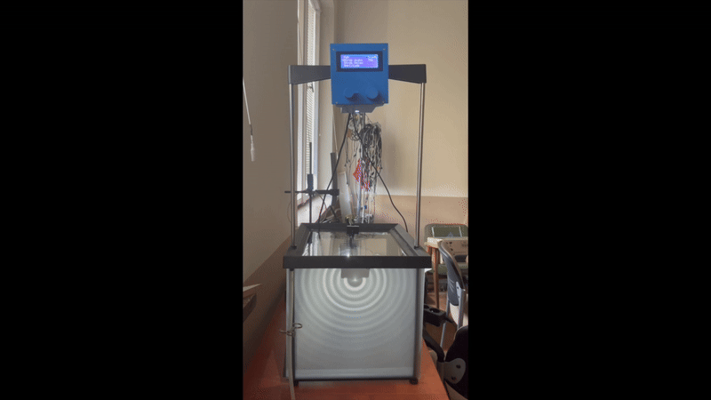
</p>

## Project Overview
This project presents the design and construction of a specialized control module for a **ripple tank:** a laboratory instrument used to demonstrate wave phenomena. The module provides precise regulation of wave parameters and incorporates a stroboscopic effect to "freeze" water ripples for detailed observation.

### Project Scope & Engineering Cycle
The project covers the entire engineering cycle, demonstrating a multidisciplinary approach to hardware design:

* **Electronics:** Advanced circuit design featuring **dual-channel Op-Amp buffers (LM358)**, high-current **MOSFET power stages (IRL540)** for 9V peripherals, and custom DAC implementation via RC filtering.

* **Software:** Real-time, low-jitter signal generation using **AVR Timer1 interrupts (ISR)** for synchronized stroboscopic effects and signal modulation.

* **Mechanics:** Custom-designed housing and mounts developed in **SolidWorks**, optimized for structural stability and laboratory ergonomics.

---

## 1. Project Evolution: From CAD to Reality

A key part of this project was the integration of mechanical design with electronics. The enclosure was designed from scratch in SolidWorks to accommodate the custom internal hardware and user interface.

<div align="center">

| View | 3D CAD Model (SolidWorks) | Final Physical Prototype |
| :---: | :---: | :---: |
| **Front** | 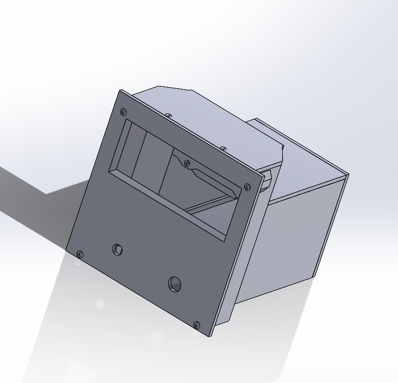 | 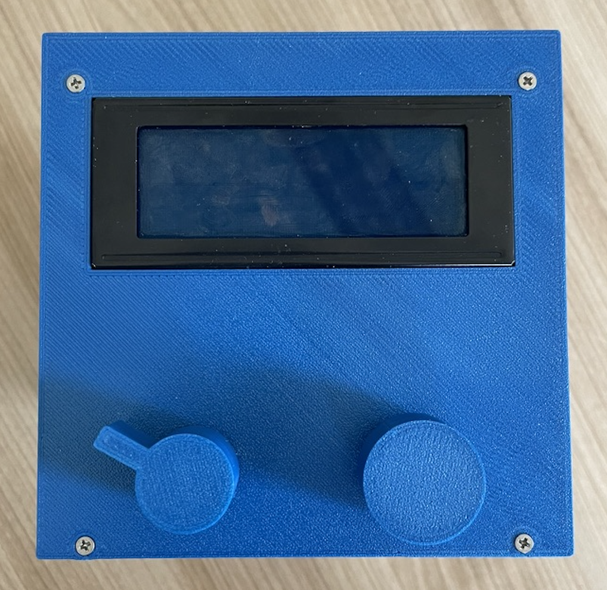 |
| **Back** | 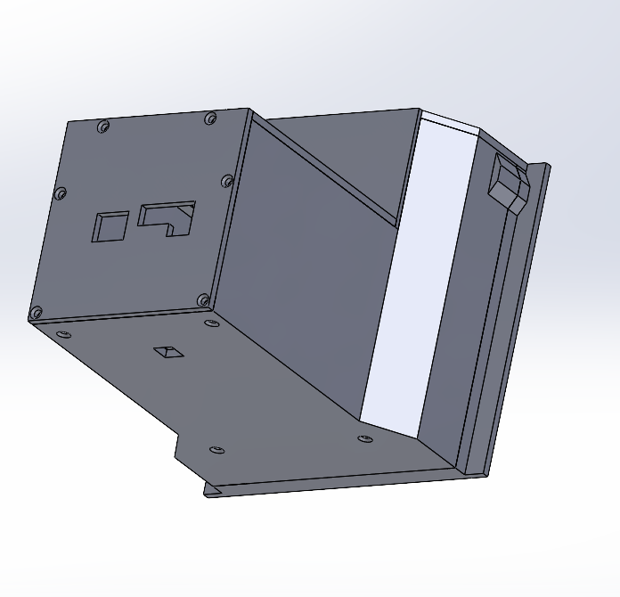 | 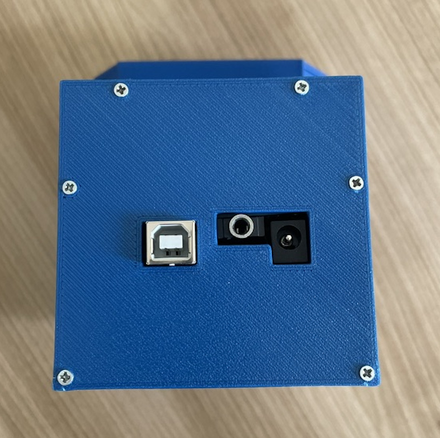 |

</div>

### 1.1 Design Philosophy & Ergonomics
The housing was designed with a clear separation between control and connectivity:

* **Front Panel (User Interface):** Optimized for real-time experimentation. It features:
  * **LCD 20x4 display** for telemetry, 
  
  * **Rotary Encoder** for parameter tuning, 
  
  * **Analog Potentiometer** for high-precision frequency control.

* **Back Panel (Connectivity):** Houses the system's "engine" and external links. Features include:
    * **USB-B Port:** Direct access to the Arduino for firmware updates and serial monitoring.
    
    * **12V DC Power Socket:** Main power input (internally regulated/clamped to 9V by the system for optimal Arduino and peripheral stability).
    
    * **3.5mm Mini-Jack Output:** Dedicated high-current connection for the mechanical actuator (speaker membrane) of the ripple tank system.
    
### 1.3 Internal Layout & Thermal Management
The internal architecture was designed to handle the physical constraints of high-power components within a 3D-printed enclosure:

* **Mounting & Durability:** The top panel features an **integrated mounting point with a heat-set brass insert**. This allows for a robust, threaded connection to the apparatus, preventing the wear and tear typical of threading directly into plastic.

* **Thermal Mitigation Strategy:** High-power resistors and the stroboscopic LED are mounted on a **factory-grade metal plate**. While not a thermal insulator, the plate provides two critical advantages:
    * **Air Gap & Contact Prevention:** It ensures that the heat-generating components have no direct contact with the PLA housing, preventing localized melting.
    * **Passive Heat Spreading:** It acts as a primary heat spreader, distributing thermal energy across its surface area before it reaches the enclosure walls.

* **Internal Clearances:** All internal mounts were modeled in SolidWorks to ensure perfectly aligned access to the USB-B, 3.5mm Jack, and DC Power ports, while maintaining sufficient airflow around the Arduino Proto-Shield.

**Files for 3D printing (STL) can be found here:** [`./hardware/stl`](./hardware/stl)

---

## 2. System Description & Electronics

The hardware architecture is centered around the ATmega328P microcontroller, featuring dedicated analog stages for signal conditioning, power management, and user interface control.

### 2.1 Component Mapping & Signal Path

| Component | Physical Pin | Technical Implementation | Function |
| :--- | :--- | :--- | :--- |
| **Rotary Encoder** | **D5, D6 (Input)** | Digital (Internal Pull-up) | Menu navigation & parameter adjustment |
| **Push Button** | **D7 (Input)** | Digital (Internal Pull-up) | Toggle layers & settings (short) / Save to EEPROM (long) |
| **Potentiometer** | **A1 (Input)** | Analog + Software Hysteresis | Frequency Input: Stable 1–100 Hz adjustment |
| **Speaker** | **D9 (Output)** | Shunt (BC547B) + Buffer + IRL540 | **9V Wave Actuator:** High-speed frequency switching |
| **Strobe LED** | **D4 (Output)** | Buffer (LM358) + MOSFET (IRL540) | **9V Optical Sync:** Precision stroboscopic flash |
| **Arduino Signal** | **D11 (Output)** | PWM + RC Filter ($10\text{k}\Omega/100\mu\text{F}$) | **Amplitude Control:** High-fidelity analog voltage |
| **LCD (I2C 0x3F)** | **A4, A5 (I/O)** | I2C Communication (20x4) | Real-time UI & parameter feedback display |

### 2.2 Circuit Design & Hardware Implementation
The system architecture is based on a structured schematic designed to ensure signal integrity and efficient power distribution. The hardware was implemented as a high-fidelity prototype using a **point-to-point wiring** approach on an Arduino Proto-Shield.

<p align="center">
  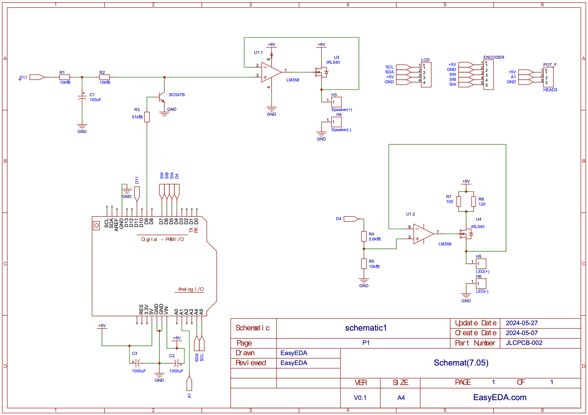
  <br>
  <a href="docs/images/project/circuit_eda.pdf"><strong>📄 Download Full Schematic (PDF)</strong></a>
</p>

To manage high-current loads and overcome the lack of a built-in DAC, the circuit incorporates a dual-channel analog stage with high-current isolation:

* **Control Interface & Signal Modulation:**
    * **Analog Potentiometer (A1):** Dedicated to real-time **Frequency control (D9)**. Provides immediate response by mapping the analog value to `Timer1` registers.
        
      * **Frequency Modulation:** A **BC547B NPN shunt** on pin D9 "chops" the DC reference to ground, providing zero-latency frequency switching without affecting the RC-filter capacitor's charge.
       
    * **Rotary Encoder (D5, D6, D7):** Manages the digital UI menu and fine-tunes the following parameters:
    
      * **Amplitude (D11)**: Generated via a PWM-to-DC **RC filter** ($10\text{k}\Omega / 100\mu\text{F}$). Adjusts the **PWM duty cycle**, which the RC filter converts into an analog voltage reference.
  
      * **Strobe Width (D4)**: Sets the duration of the LED flash within the interrupt cycle to eliminate motion blur. 
  
      * **Pulse Delay (D4)**: Adjusts the phase shift between the mechanical wave and the light pulse, allowing the user to "freeze" the wave at different points in its cycle.

* **Dual Active Buffering (LM358):** 
  * Both the Wave Actuator and Stroboscopic LED channels utilize an **LM358 Op-Amp** configured as a **Voltage Follower**. This provides high input impedance to protect the control signals and low output impedance to drive the power MOSFETs without voltage drops.

* **High-Power Output Stage (9V Rail):** 
  * Two **IRL540 Power MOSFETs** act as the final drivers for the actuator and LED. By drawing current directly from the **9V power rail**, they isolate the 5V logic from high-current spikes and prevent system instability.

* **Stroboscopic LED Precision:** The LED drive includes a voltage divider ($5.6\text{k}\Omega / 10\text{k}\Omega$) and **parallel power resistors** to distribute heat dissipation, ensuring the high-intensity LED operates at a safe 3.2V / 100mA point.

* **Power Integrity:** Massive **1000µF decoupling capacitors** are placed across both the 5V and 9V rails to stabilize the supply during simultaneous operation of the mechanical actuator and LED pulses.
  
---

## 3. Software Architecture & Implementation

The firmware focuses on non-blocking execution and low-level hardware control.

### 3.1 Functional Specification

- **PWM and Pulse Control**
Frequency, duty cycle, and pulse parameters are generated using **Timer1 in CTC mode** for high precision. This allows for manual control over the AVR timers (`TCCR1A`, `TCCR1B`), essential for scientific experiments where timing jitter must be minimized.

- **Software Optimization (Lookup Table)**
To ensure instantaneous response and minimize CPU overhead, frequency calculations are performed using a pre-calculated **Lookup Table**. Each entry maps a target frequency to specific **OCR1A** register values.

  **Timer1 Calculation Example ($f_{clk} = 16 \text{ MHz}$):**

    * **100 Hz:** $\frac{16,000,000}{(624+1) \cdot 1} = 25600 \text{ Hz}$ (Internal Interrupt) $\rightarrow 100 \text{ Hz}$ (Final Output)

    * **1 Hz:** $\frac{16,000,000}{(62499+1) \cdot 1} = 256 \text{ Hz}$ (Internal Interrupt) $\rightarrow 1 \text{ Hz}$ (Final Output)
  
<details>
  <summary><b>Click to expand full Frequency Lookup Table (1 Hz – 100 Hz)</b></summary>

| Step (ISR Freq) | Target Frequency | Period ($T$) | OCR1A Value |
| :--- | :--- | :--- | :--- |
| 256 Hz | **1 Hz** | 1000.0 ms | 62499 |
| 512 Hz | **2 Hz** | 500.0 ms | 31249 |
| 768 Hz | **3 Hz** | 333.3 ms | 20832 |
| 1024 Hz | **4 Hz** | 250.0 ms | 15624 |
| 1280 Hz | **5 Hz** | 200.0 ms | 12499 |
| 1536 Hz | **6 Hz** | 166.7 ms | 10415 |
| 1792 Hz | **7 Hz** | 142.9 ms | 8927 |
| 2048 Hz | **8 Hz** | 125.0 ms | 7811 |
| 2304 Hz | **9 Hz** | 111.1 ms | 6943 |
| 2560 Hz | **10 Hz** | 100.0 ms | 6249 |
| 2816 Hz | **11 Hz** | 90.9 ms | 5680 |
| 3072 Hz | **12 Hz** | 83.3 ms | 5207 |
| 3328 Hz | **13 Hz** | 76.9 ms | 4806 |
| 3584 Hz | **14 Hz** | 71.4 ms | 4463 |
| 3840 Hz | **15 Hz** | 66.7 ms | 4165 |
| 4096 Hz | **16 Hz** | 62.5 ms | 3905 |
| 4352 Hz | **17 Hz** | 58.8 ms | 3675 |
| 4608 Hz | **18 Hz** | 55.6 ms | 3471 |
| 4864 Hz | **19 Hz** | 52.6 ms | 3288 |
| 5120 Hz | **20 Hz** | 50.0 ms | 3124 |
| 5376 Hz | **21 Hz** | 47.6 ms | 2975 |
| 5632 Hz | **22 Hz** | 45.5 ms | 2839 |
| 5888 Hz | **23 Hz** | 43.5 ms | 2716 |
| 6144 Hz | **24 Hz** | 41.7 ms | 2603 |
| 6400 Hz | **25 Hz** | 40.0 ms | 2499 |
| 6656 Hz | **26 Hz** | 38.5 ms | 2402 |
| 6912 Hz | **27 Hz** | 37.0 ms | 2313 |
| 7168 Hz | **28 Hz** | 35.7 ms | 2231 |
| 7424 Hz | **29 Hz** | 34.5 ms | 2154 |
| 7680 Hz | **30 Hz** | 33.3 ms | 2082 |
| 7936 Hz | **31 Hz** | 32.3 ms | 2015 |
| 8192 Hz | **32 Hz** | 31.3 ms | 1952 |
| 8448 Hz | **33 Hz** | 30.3 ms | 1892 |
| 8704 Hz | **34 Hz** | 29.4 ms | 1837 |
| 8960 Hz | **35 Hz** | 28.6 ms | 1784 |
| 9216 Hz | **36 Hz** | 27.8 ms | 1735 |
| 9472 Hz | **37 Hz** | 27.0 ms | 1688 |
| 9728 Hz | **38 Hz** | 26.3 ms | 1643 |
| 9984 Hz | **39 Hz** | 25.6 ms | 1601 |
| 10240 Hz | **40 Hz** | 25.0 ms | 1561 |
| 10496 Hz | **41 Hz** | 24.4 ms | 1523 |
| 10752 Hz | **42 Hz** | 23.8 ms | 1487 |
| 11008 Hz | **43 Hz** | 23.3 ms | 1452 |
| 11264 Hz | **44 Hz** | 22.7 ms | 1419 |
| 11520 Hz | **45 Hz** | 22.2 ms | 1387 |
| 11776 Hz | **46 Hz** | 21.7 ms | 1357 |
| 12032 Hz | **47 Hz** | 21.3 ms | 1328 |
| 12288 Hz | **48 Hz** | 20.8 ms | 1301 |
| 12544 Hz | **49 Hz** | 20.4 ms | 1274 |
| 12800 Hz | **50 Hz** | 20.0 ms | 1249 |
| 13056 Hz | **51 Hz** | 19.6 ms | 1224 |
| 13312 Hz | **52 Hz** | 19.2 ms | 1200 |
| 13568 Hz | **53 Hz** | 18.9 ms | 1178 |
| 13824 Hz | **54 Hz** | 18.5 ms | 1156 |
| 14080 Hz | **55 Hz** | 18.2 ms | 1135 |
| 14336 Hz | **56 Hz** | 17.9 ms | 1115 |
| 14592 Hz | **57 Hz** | 17.5 ms | 1095 |
| 14848 Hz | **58 Hz** | 17.2 ms | 1076 |
| 15104 Hz | **59 Hz** | 16.9 ms | 1058 |
| 15360 Hz | **60 Hz** | 16.7 ms | 1040 |
| 15616 Hz | **61 Hz** | 16.4 ms | 1023 |
| 15872 Hz | **62 Hz** | 16.1 ms | 1007 |
| 16128 Hz | **63 Hz** | 15.9 ms | 991 |
| 16384 Hz | **64 Hz** | 15.6 ms | 975 |
| 16640 Hz | **65 Hz** | 15.4 ms | 960 |
| 16896 Hz | **66 Hz** | 15.2 ms | 945 |
| 17152 Hz | **67 Hz** | 14.9 ms | 931 |
| 17408 Hz | **68 Hz** | 14.7 ms | 918 |
| 17664 Hz | **69 Hz** | 14.5 ms | 904 |
| 17920 Hz | **70 Hz** | 14.3 ms | 891 |
| 18176 Hz | **71 Hz** | 14.1 ms | 879 |
| 18432 Hz | **72 Hz** | 13.9 ms | 867 |
| 18688 Hz | **73 Hz** | 13.7 ms | 855 |
| 18944 Hz | **74 Hz** | 13.5 ms | 843 |
| 19200 Hz | **75 Hz** | 13.3 ms | 832 |
| 19456 Hz | **76 Hz** | 13.2 ms | 821 |
| 19712 Hz | **77 Hz** | 13.0 ms | 810 |
| 19968 Hz | **78 Hz** | 12.8 ms | 800 |
| 20224 Hz | **79 Hz** | 12.7 ms | 790 |
| 20480 Hz | **80 Hz** | 12.5 ms | 780 |
| 20736 Hz | **81 Hz** | 12.3 ms | 770 |
| 20992 Hz | **82 Hz** | 12.2 ms | 761 |
| 21248 Hz | **83 Hz** | 12.0 ms | 752 |
| 21504 Hz | **84 Hz** | 11.9 ms | 743 |
| 21760 Hz | **85 Hz** | 11.8 ms | 734 |
| 22016 Hz | **86 Hz** | 11.6 ms | 725 |
| 22272 Hz | **87 Hz** | 11.5 ms | 717 |
| 22528 Hz | **88 Hz** | 11.4 ms | 709 |
| 22784 Hz | **89 Hz** | 11.2 ms | 701 |
| 23040 Hz | **90 Hz** | 11.1 ms | 693 |
| 23296 Hz | **91 Hz** | 11.0 ms | 685 |
| 23552 Hz | **92 Hz** | 10.9 ms | 678 |
| 23808 Hz | **93 Hz** | 10.8 ms | 671 |
| 24064 Hz | **94 Hz** | 10.6 ms | 663 |
| 24320 Hz | **95 Hz** | 10.5 ms | 656 |
| 24576 Hz | **96 Hz** | 10.4 ms | 650 |
| 24832 Hz | **97 Hz** | 10.3 ms | 643 |
| 25088 Hz | **98 Hz** | 10.2 ms | 636 |
| 25344 Hz | **99 Hz** | 10.1 ms | 630 |
| 25600 Hz | **100 Hz** | 10.0 ms | 624 |

</details>

### 3.2 Real-Time Control Logic
* **Non-blocking Interface:** The menu is handled via state-machine logic, ensuring the display updates without interrupting signal generation.
* **Encoder Handling:** Interrupt-driven logic distinguishes between short presses (navigation) and long presses (saving data).

### 3.3 Signal Stability & Hysteresis
* **Analog Debouncing (Hysteresis):** To prevent LCD flickering and frequency "jumping" due to noise on the analog pot, I implemented software hysteresis (`abs(freqValue - lastFreqValue) > 5`).
* **Stroboscopic Synchronization:** LED flashes are precisely timed with wave fronts to enable "freezing" the motion of water for optical analysis.

### 3.4 Data Persistence (EEPROM)
Key experimental parameters (PWM, Strobe Width, Delay, Amplitude) are stored in the **EEPROM**. The system automatically restores the last used configuration upon startup.

### 3.5 Hardware-Timed Interrupts (ISR)
To ensure maximum signal stability, the wave generation logic is decoupled from the main execution loop:
- **Asynchronous Generation:** I implemented an **Interrupt Service Routine (ISR)** triggered by Timer1 in CTC mode.
- **Jitter Elimination:** This guarantees that time-critical tasks (pulse generation and stroboscopic sync) are not delayed by slower I/O operations like LCD updates.

#### Key Implementation Detail: Timer1 ISR
```cpp
ISR(TIMER1_COMPA_vect) {
    divider++;
    if(divider > 255) { 
        digitalWrite(speakerPin, HIGH);
        divider = 0;
        previousMillis = millis();
    }
    else if(divider == dutyCycle) { 
        digitalWrite(speakerPin, LOW);
    }
}
```

**Full source code is available here:** [`software/control-module/control-module.ino`](./software/control-module/control-module.ino)


---

## 4. Testing & Results (Validation)

### 4.1 Signal Validation (Oscilloscope Tests)
The following measurements verify the accuracy of the generated waveforms:

<div align="center">

| Parameter | Measurement | Parameter | Measurement |
| :--- | :---: | :--- | :---: |
| **Frequency (100 Hz)** | 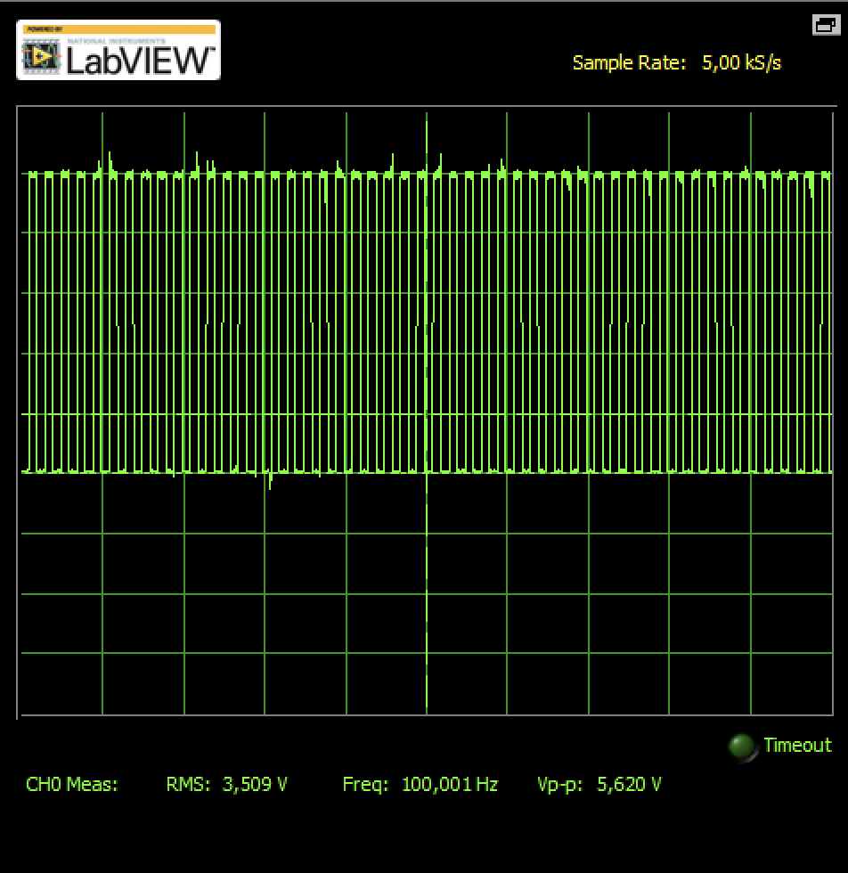 | **Amplitude (75%)** | 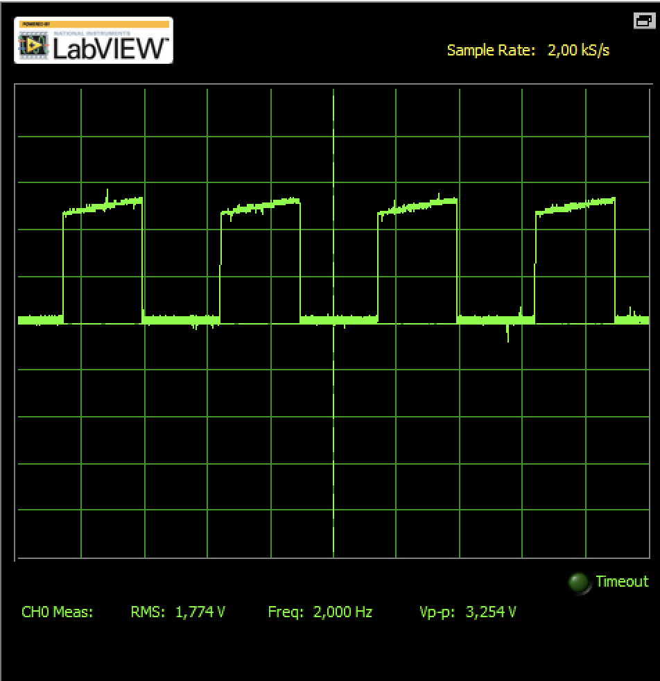 |
| **PWM (75%)** | 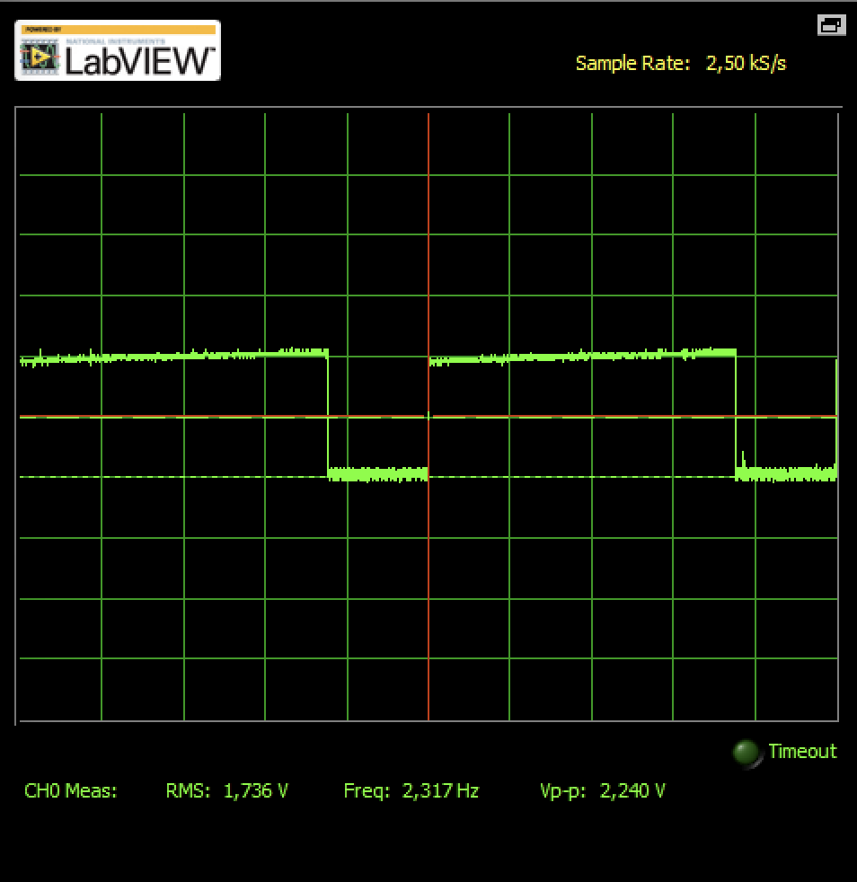 | **Strobe Width (10%)** | 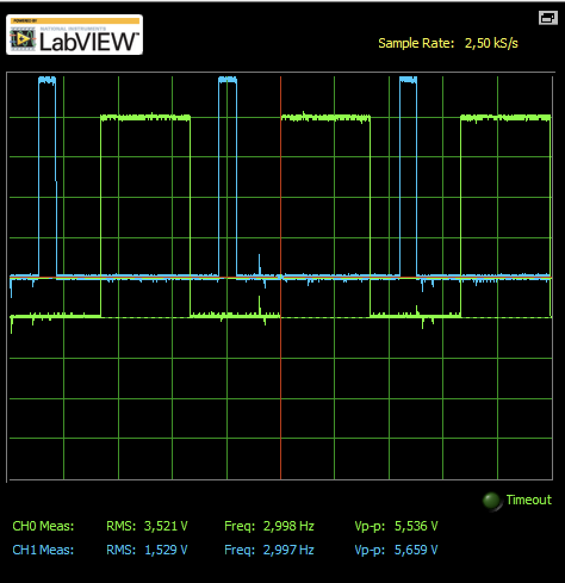 |
| **Pulse Delay (50%)** | 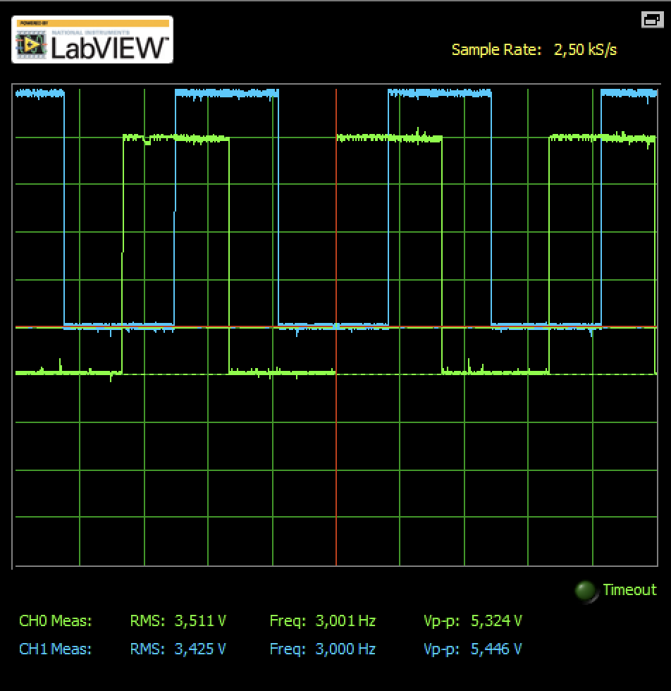 | | |

</div>


### 4.2 Visual Validation: Stroboscopic Effect & Synchronization
The system's ability to "freeze" water ripples for precise observation was verified by correlating the control module's real-time settings with the physical wave output.

<div align="center">

<p align="center">
  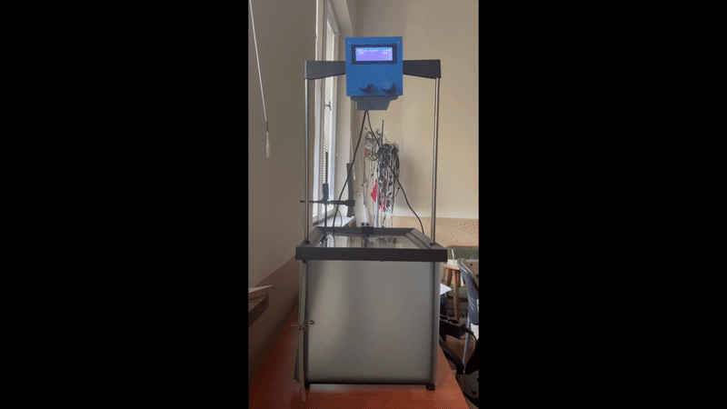
</p>

| Module Settings (Input) | Wavefront Observation (Output) |
| :---: | :---: |
| 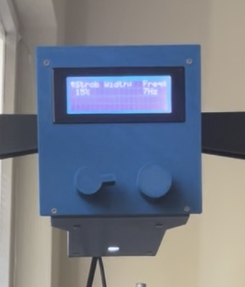 | 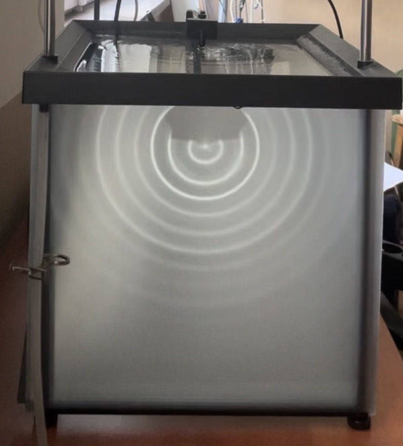 |

</div>

**Technical Observations & Analysis (15% Strobe Width at 7 Hz):**

* **Localized Sharpness:** The stroboscopic "freezing" effect is most prominent near the wave source (actuator), where the wavefronts exhibit high contrast and defined edges.

* **Synchronization Proof:** The clarity of the inner ripples while the actuator is in active motion confirms that the **Timer1 ISR** is correctly triggering the LED pulses in phase with the mechanical vibration.

* **Attenuation & Dispersion:** Further from the center, the wavefronts and reflected light become less distinct. This is a natural result of wave energy attenuation in the medium and the decreasing intensity of reflected light at shallower observation angles.

* **Optical Balance:** The **15% Strobe Width** (visible on the LCD) provides a calibrated balance between sufficient illumination and a pulse duration short enough to minimize motion blur near the source.

* **Phase Adjustment:** By modifying the `Pulse Delay` parameter, the observed wave can be "shifted" in time, enabling the study of phase velocity and interference in a seemingly stationary state.

---

## 5. Tools and Libraries

- **Mechanical Design (CAD):** SolidWorks 
- **Development Environment:** Arduino IDE  
- **Core Libraries:** `Wire.h`, `LiquidCrystal_I2C.h`, `EEPROM.h`
- **Technical References:**
  - [Electronoobs Timer Tutorial](https://electronoobs.com/eng_arduino_tut125.php)
  - [Arduino Button Timing & Debouncing](https://arduinogetstarted.com/tutorials/arduino-button-long-press-short-press)
  - [Arduinoslovakia Timer Cacluator](https://www.arduinoslovakia.eu/application/timer-calculator)

---

**Note:** This repository is a part of an academic thesis project. Full documentation and theoretical background can be found here: [`docs/thesis.pdf`](./docs/thesis.pdf).